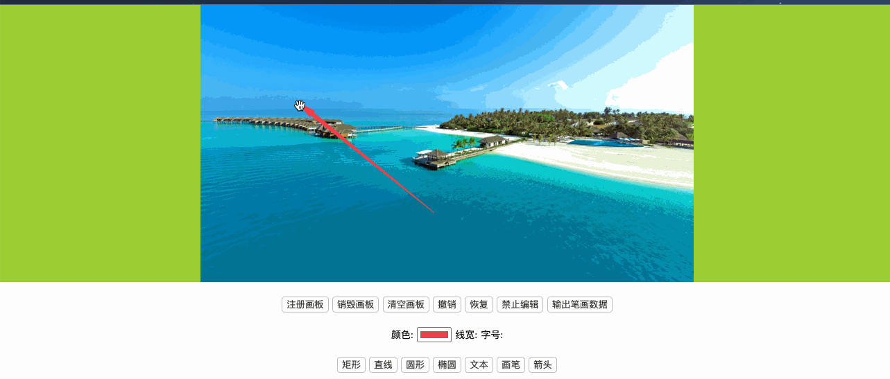

# DZMDrawingBoardWebSvg

- 支持在视频、图片上面进行编辑的 svg 画板，支持旋转、拖拽、修改、撤销、恢复、字号、颜色....

- [当前 DEMO CSDN 文章](https://blog.csdn.net/zz00008888/article/details/121489922)

- [前端 SVG 与 Canvas 框架案例](https://blog.csdn.net/zz00008888/article/details/120987225)

#### DEMO 效果：

